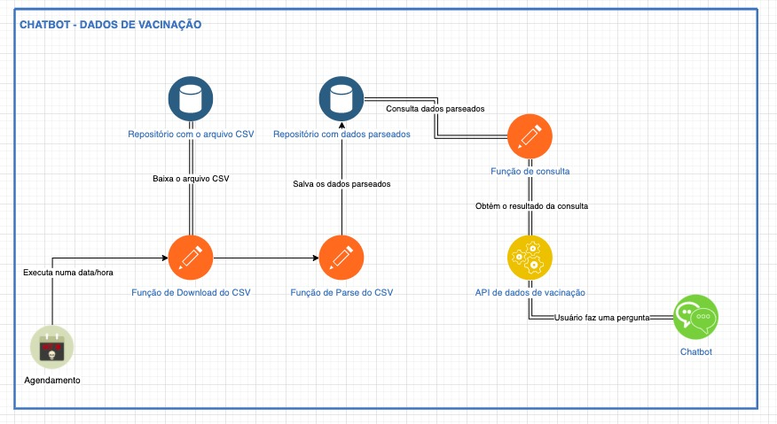

# Dados de Vacinação

## Proposta Inicial

A ideia era permitir que o bot fosse questionado a respeito das vacinações. Inicialmente, a ideia era fazer do Brasil todo, no entanto, não foi possível encontrar um dataset sumarizado, apenas com informações individuais de pacientes. Por conta disso, foi decidido utilizar apenas os dados de Santa Catarina.

## Tecnologias Utilizadas

1. IBM DB2
2. IBM Function

## Descrição da Solução

A partir dos dados de Santa Catarina encontrados no [OpenDataSus][open-data-sus], elaboramos um desenho de arquitetura inicial, conforme a Figura 1. A ideia inicial era fazer o download do arquivo CSV diariamente e depois processar os dados em um banco de dados para então o bot executar as consultas.

No entanto, por questões de tempo e também experiência com a IBM, parte desta arquitetura não foi possível de ser implementada. Para simplificar a solução, o arquivo `csv` com dados de Santa Catarina foi então carregado diretamente em um banco DB2 e então uma IBM Function, implementada em Node JS 12, efetua as consultas de números de vacinações efetuadas em cada um dos munícipios (com base no nome do município).

A implementação da Function está documentada no arquivo `main.js`.

## Aprendizado e Melhorias Futuras

Foi bastante proveitoso e de bastante aprendizado, principalmente para conhecer e explorar os serviços da IBM, onde foi necessário fazer a consulta, integrar com a função e também com o bot.
Para uma segunda versão, seria interessante dar continuidade com a arquitetura planejada inicialmente, com algumas adaptações, principalmente para reduzir a quantidade de dados armazenados, salvando apenas a quantidade de doses por municípios e também aumentar a quantidade de perguntas que o bot pode responder.

[open-data-sus]: https://opendatasus.saude.gov.br/dataset/covid-19-vacinacao/resource/ef3bd0b8-b605-474b-9ae5-c97390c197a8